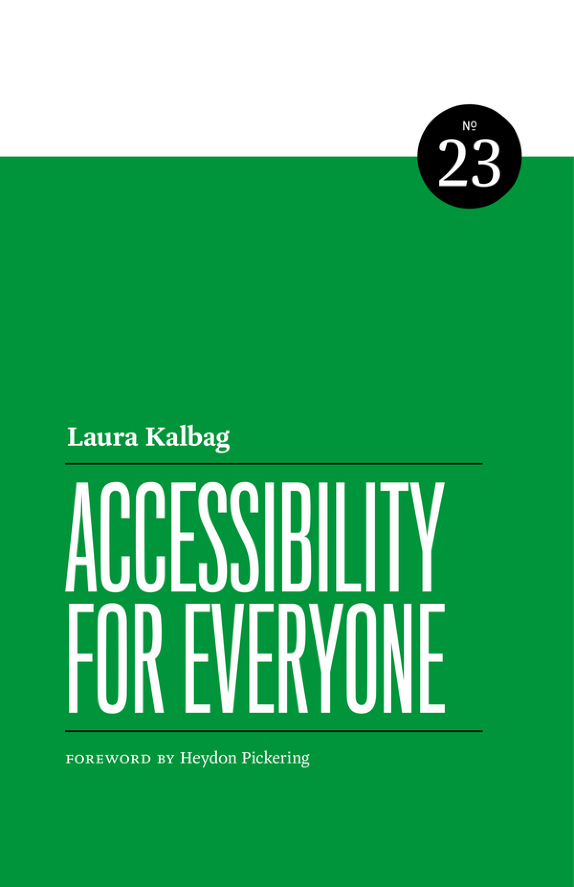

- [Paperback](#buy-the-paperback-book)
- [Ebook](#buy-the-ebook)
- [Audiobook](#audiobook)
- [Libraries and other distributers](#libraries-and-other-distributers)

Hello friends. You might’ve heard that [Accessibility For Everyone](https://abookapart.com/products/accessibility-for-everyone) and all A Book Apart books are no longer available to buy from A Book Apart. 

**The book will be available to read and buy from here very soon!**

The good news is that all of us authors have got our book rights and are moving to self-publishing, and most of these books are now available to buy, borrow, and rent in many different locations.

To start, I lowered the price of the book. It may still be available for a while from the locations below. In the next couple of months, I intend to make it easier to access, so stay tuned!
## Buy the paperback book

Buy the paperback book for the real printed hold-it-in-your-hands experience. Many of these stores will sell outside of these countries. If you are struggling to find a store that will ship a book to your country, please [let me know by email](mailto:hello@laurakalbag.com).

### United States and Canada
* [Amazon](https://www.amazon.com/Accessibility-Everyone-Laura-Kalbag-ebook/dp/B0CW32PM5P/)
* [Barnes & Noble](https://www.barnesandnoble.com/w/accessibility-for-everyone-laura-kalbag/1129764593)
* [Independent bookstores via Bookshop.org](https://bookshop.org/p/books/accessibility-for-everyone-laura-kalbag/20097156)
* [Walmart.com](https://www.walmart.com/ip/Accessibility-for-Everyone-Paperback-9781952616327/3435476455)
* [Chapters / Indigo (Canada)](https://www.indigo.ca/en-ca/accessibility-for-everyone/9781952616327.html)

### Europe
* [Adlibris](https://www.adlibris.com/se/bok/accessibility-for-everyone-9781952616327)
* [Agapea](https://www.agapea.com/libros/Accessibility-for-Everyone-9781952616327-i.htm)
* [Amazon.co.uk](https://www.amazon.co.uk/Accessibility-Everyone-Laura-Kalbag/dp/1952616328/)
* [Amazon.de](https://www.amazon.de/-/en/Laura-Kalbag/dp/1952616328/)
* [Blackwell](https://blackwells.co.uk/bookshop/product/Accessibility-for-Everyone-by-Laura-Kalbag/9781952616327)
* [Foyles](https://www.foyles.co.uk/book/accessibility-for-everyone/laura-kalbag/9781952616327)
* [Waterstones](https://www.waterstones.com/book/accessibility-for-everyone/laura-kalbag/9781952616327)

### Australia and New Zealand
* [Amazon AU](https://www.amazon.com.au/Accessibility-Everyone-Laura-Kalbag-ebook/dp/B0CW32PM5P/)
* [Fishpond](https://www.fishpond.com.au/Books/Accessibility-for-Everyone-Kalbag-Laura/9781937557614)

## Buy the ebook

* [Amazon](https://www.amazon.com/Accessibility-Everyone-Laura-Kalbag-ebook/dp/B0CW32PM5P/)
* [Apple](https://books.apple.com/book/accessibility-for-everyone/id6478189890)
* [Barnes & Noble Nook](https://www.barnesandnoble.com/w/accessibility-for-everyone-laura-kalbag/1129764593)
* [eBooks.com](https://www.ebooks.com/en-ie/book/211235340/accessibility-for-everyone/laura-kalbag/)
* [Glose](https://glose.com/book/accessibility-for-everyone)
* [Kobo](https://www.kobo.com/us/en/ebook/accessibility-for-everyone)
* [OverDrive](https://www.overdrive.com/media/10528472/accessibility-for-everyone)
* [RedShelf](https://redshelf.com/app/ecom/book/874826/accessibility-for-everyone-874826-9781937557621-laura-kalbag)
* [Scribd/Everand](https://www.everand.com/book/707222531/Accessibility-for-Everyone)
* [Snapplify](https://shop.snapplify.com/product/accessibility-for-everyone)
* [Wheelers](https://www.wheelersbooks.com.au/product/Accessibility-for-Everyone-Laura-Kalbag/9781952616327)
* [Wook](https://www.wook.pt/ebook/accessibility-for-everyone-laura-kalbag/29754016)

## Audiobook

This will be available very soon. If you need access to the audiobook right now, please [email me](mailto:hello@laurakalbag.com).

## Libraries and other distributers

You should also be able to get copies of the ebook from the following stores, apps, and library services (no online links available):

* Ainosco
* ALS
* Aphrohead
* Bibliotheca
* BibliU
* Bolinda
* Books Express
* Booktopia
* Chegg
* Coutts Information Services Ltd
* De Marque
* Designarta Books
* EBSCO
* Eden Interactive Ltd
* fable
* Follett/B&T
* Gardners
* hoopla
* Hummingbird
* iGroup
* ITSI
* James Bennett
* Kortex
* Legible
* Libreka
* Libri Gmbh
* Libro.fm
* Mackin
* Mallory International
* Odilo
* Paperback Shop Ltd
* Perlego
* Perusall
* Peter Pal
* ProQuest
* Storytel
* Superbookdeals
* Takealot
* The Book Community Ltd
* The Nile
* Trust Media Distribution (formerly STL)
* VitalSource
* Wrap Distribution
* YouScribe